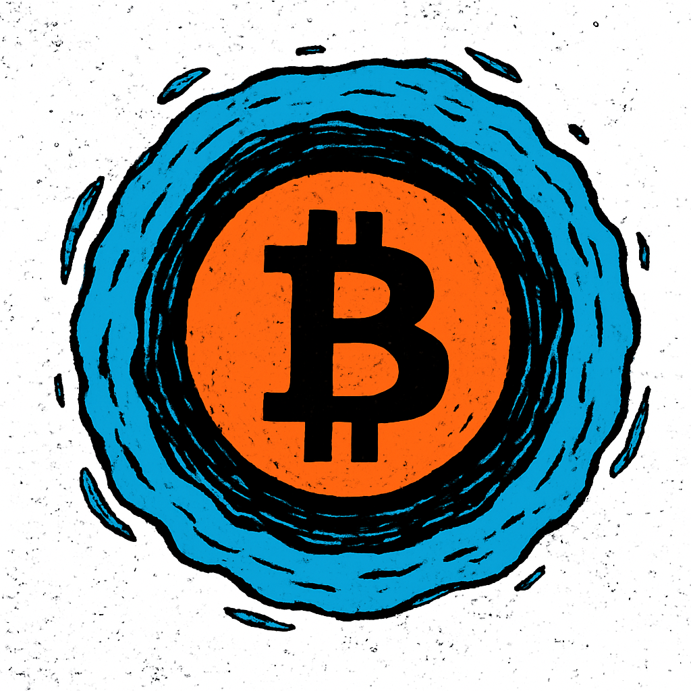

# POR7AL
Lock Prophe7s on stake address for migration to BTC

# How it works 
In general, I was looking for a simple way to bind NFTs to an address without being able to move / spend them at all or only to a limited extent. But still have them somehow in your wallet.

To achieve this we use the fact that a address on Cardano always consist of 3 different parts. 1. Header 2. Payment credentials 3. Stake credenials. 

<pre> ┃ Header ┃ Payment credentials ┃ Stake credentials ┃ </pre>

So lets take a Example address:      addr1qyfqzuyzjv7cpwt02sx6l5wc8w7krym8306m8r8yx45uvhvvcyar2x94c4z5dwec8zxag65ujll2axu7s57lgdlw9hdqu2kmkf

<pre> {
  "address": {
    "bech32": "addr1qyfqzuyzjv7cpwt02sx6l5wc8w7krym8306m8r8yx45uvhvvcyar2x94c4z5dwec8zxag65ujll2axu7s57lgdlw9hdqu2kmkf",
    "hex": "0112017082933d80b96f540dafd1d83bbd6193678bf5b38ce43569c65d8cc13a3518b5c54546bb38388dd46a9c97feae9b9e853df437ee2dda"
  },
  "networkId": 1,
  "paymentCredential": {
    "type": "Key",
    "hash": "12017082933d80b96f540dafd1d83bbd6193678bf5b38ce43569c65d"
  },
  "stakeCredential": {
    "type": "Key",
    "hash": "8cc13a3518b5c54546bb38388dd46a9c97feae9b9e853df437ee2dda"
  }
}
 </pre>

## User Part 
To determine the specific lock address, we take his normal wallet address and extract the delegations part.

StakeCredential-> 8c13a3518b5c54546bb38388dd46a9c97feae9b9e853df437ee2dda

## Locking Smart Contract
Through smart contracts, we can now create special sc address which provide the payment part of the total lock address then.

Example everlock.ak

This validator will never be spendable because we check if  #[7] equals #[0] in the query. What will never been true. So all NFTs locked on this paymentkey can never been spend.

This is then combined into a specific lock address

So the resulting lock address is then:

addr1z9mqzlpknx0q2e7ukwu96u2mzl04z6n8ca3c78v5qsh5fpuvcyar2x94c4z5dwec8zxag65ujll2axu7s57lgdlw9hdq38pdvt

With this we have a elegant way to keep the NFT on your stake key but not make it spendable by replace the payment part with the address of the sc.

## Example TA: Locking 01PROPHE7 on Lace paperwallet address on Mainnet

https://cardanoscan.io/transaction/1b16696772ea1f714b997e6d0a28b255e27a311870dfb27554f8612312026a24

The NFT is now locked for ever on this special generated lock adress but still in a utxo inside the general user wallet.

## 6. NFT Links:

https://pool.pm/addr1qyfqzuyzjv7cpwt02sx6l5wc8w7krym8306m8r8yx45uvhvvcyar2x94c4z5dwec8zxag65ujll2axu7s57lgdlw9hdqu2kmkf

https://www.jpg.store/asset/359f7528061497ac217e556706220adbe1755f14642523ce7150dcbe303150524f50484537

